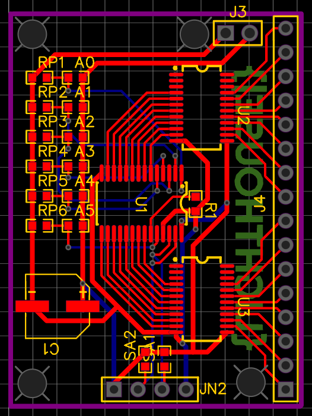
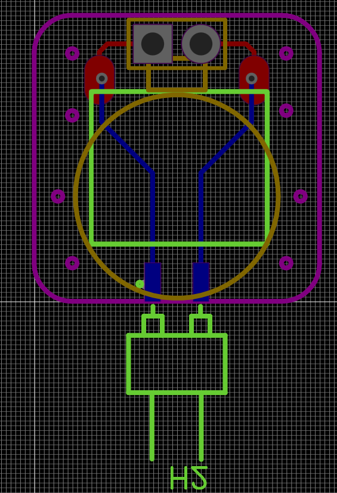

# LightHouse: Open Source Accessible Devices For Visually Impaired People

The LightHouse is an open-source portable device that provides surrounding environment information through tactual and auditory sensation. This project aims to become the second eye for visually impaired people, just like a lighthouse.

## About

### Motivation

There have been many works done to improve the life qualities of visually impaired people, including more accessible software and hardware. However, works now are far from enough. Many still rely on other people for navigation or even refuse to go outside. A cheap device with more accuracy in leading and identifying obstacles is needed.

## Specifications

This devices consists three main parts:

1. Sensory Module
2. Computation Module
3. Feedback Module

All of these modules are assembled on a helmet, which can give more vision to the Sensory Module, and make feedback more convenient.

### Sensory Module

Depth camera is adopted to sample the environment. RGB data is used to identify objects, and depth data is needed in identify potential obstacles.

### Computation Module

Raspberry Pi is used to do real-time calculations, getting information from Sensory Module while controling the Feedback Module to give feedback to user.

### Feedback Module

This includes a Vibration Motor Matrix and a bone-conducting earphone.

## Hardware

### Vibration Motor Driver

This driver utilized I2C protocol to control the PWM signal.

### Vibration Element

